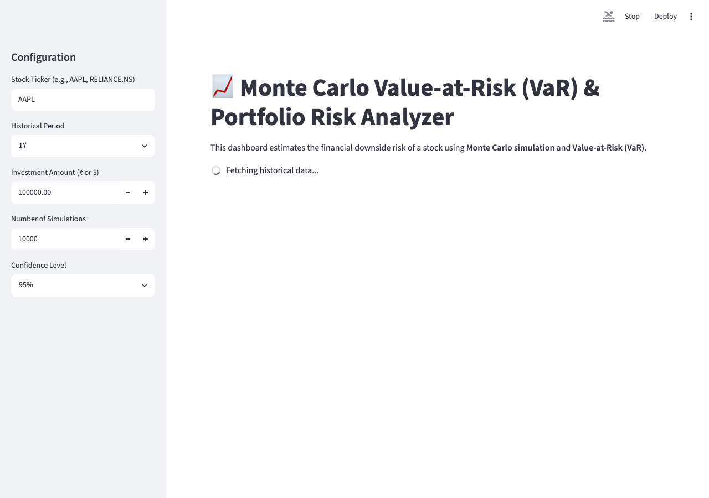

# Monte Carlo Value-at-Risk (VaR) & Portfolio Risk Analyzer

## Project Overview
Investors need to quantify the downside risk of holding financial assets. Without statistical modeling, it is difficult to estimate potential worst-case losses over a given time horizon. 

This project is a web-based financial dashboard that estimates the downside risk of a stock using **Monte Carlo simulation** and **Value-at-Risk (VaR)**. It provides a beginner-friendly yet robust tool to understand return distributions, volatility, and downside thresholds for equities.

## Problem Statement
Predicting exact future stock prices is impossible. However, we can use historical behavior (average returns and volatility) to simulate thousands of possible future scenarios. By doing this, we can mathematically estimate the worst expected loss under normal market conditions at a given confidence level.

## Features
- **Historical Data Fetching**: Automatically downloads historical stock data using `yfinance` API.
- **Return & Volatility Analysis**: Computes daily logarithmic returns, mean, and standard deviation (volatility).
- **Monte Carlo Engine**: Runs up to 100,000 randomized simulations to forecast possible future returns.
- **Value-at-Risk (VaR)**: Calculates both Historical and Monte Carlo VaR at 95% and 99% confidence levels.
- **Interactive Visualizations**: Uses Plotly to render beautiful price charts and P&L distribution histograms.

## Project Structure
```text
monte_carlo_var/
│
├── app.py                 # Streamlit dashboard and UI logic
├── risk_model.py          # Core statistical & financial calculations
├── data_loader.py         # Data fetching using yfinance
├── requirements.txt       # Python dependencies
├── README.md              # Project documentation
├── screenshots/           # UI screenshots
│   └── dashboard.png
└── tests/
    └── test_risk_model.py # Pytest suite for automated testing
```

## Methodology & Formulas

### 1. Logarithmic Returns
Instead of simple percentage changes, we use continuous logarithmic returns, which are standard in financial modeling because they are time-additive:
`R_t = ln(P_t / P_{t-1})`

### 2. Volatility
Volatility is the standard deviation (σ) of daily returns.
`Annualized Volatility = Daily Volatility * sqrt(252)`

### 3. Monte Carlo Methodology
Assuming returns follow a normal distribution, we generate thousands of simulated future returns using the historical mean (μ) and volatility (σ):
`Simulated Return = μ + σ * N(0,1)`
Where `N(0,1)` is a random variable from a standard normal distribution.

### 4. Value-at-Risk (VaR)
Value-at-Risk (VaR) estimates the potential loss that will not be exceeded with a given confidence level. For example, a 95% VaR of $500 means there is an estimated 5% chance the portfolio will lose more than $500 in a single day, assuming normal market conditions.
`VaR_95 = 5th Percentile of Simulated P&L`
`VaR_99 = 1st Percentile of Simulated P&L`

## Screenshots


## Installation Instructions

1. Clone or download the repository.
2. Ensure you have Python installed (Python 3.8+ recommended).
3. Install the required dependencies:
```bash
pip install -r requirements.txt
```

## Usage

Execute the following command in the project directory:
```bash
streamlit run app.py
```
This will launch the interactive dashboard in your default web browser (typically at `http://localhost:8501`).

## Limitations
- **Normal Distribution Assumption**: The Monte Carlo model here assumes that stock returns are normally distributed. In reality, financial markets exhibit "fat tails" (extreme events happen more frequently than a normal distribution predicts).
- **Past Performance**: The model uses historical mean and volatility, which may not accurately represent future market behavior (e.g., during unexpected market crashes).

## Future Improvements
- Add support for multi-asset portfolios (using covariance matrices).
- Implement Student's t-distribution for simulations to account for fat tails.
- Add Conditional VaR (Expected Shortfall) calculation.
- Add a backtesting feature to compare past VaR predictions with actual losses.
